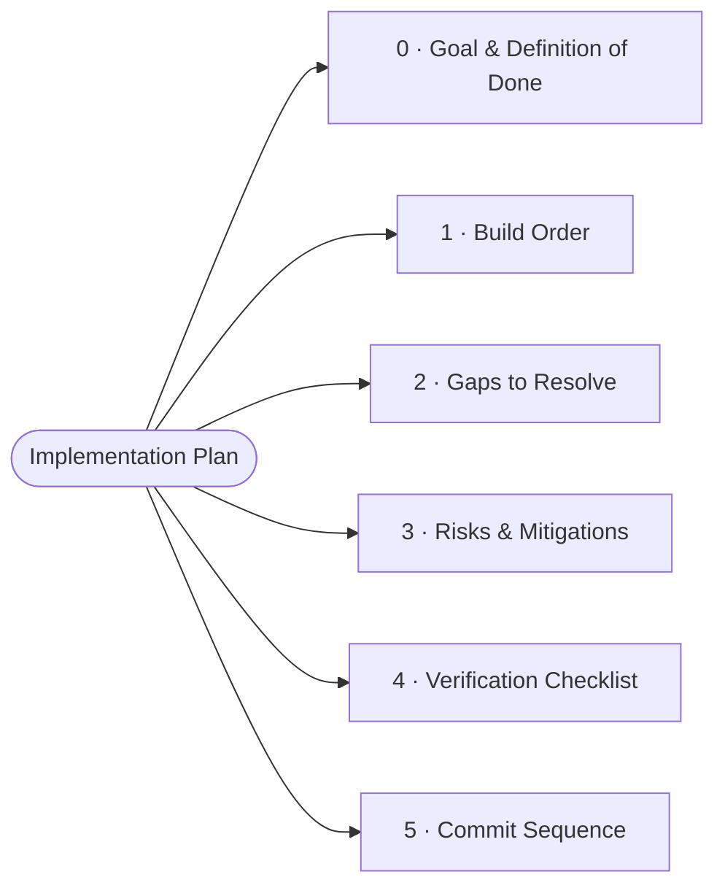
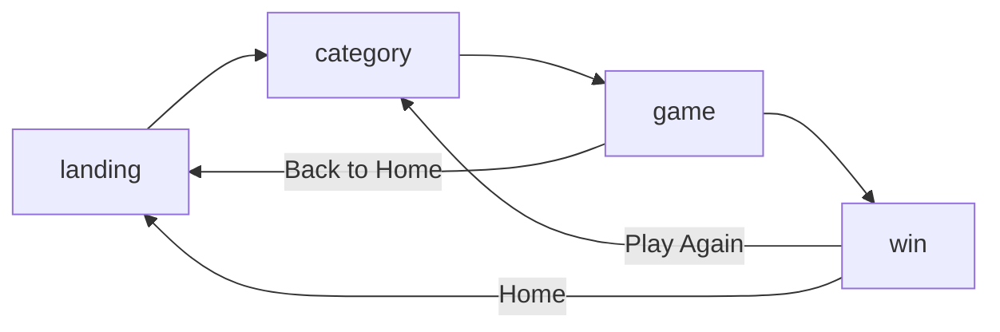
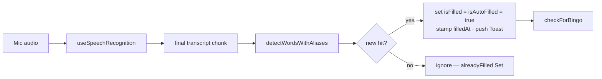
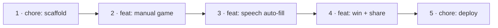

# Meeting Bingo — Implementation Plan

> **Derived from:** `meeting-bingo-prd.md` · `meeting-bingo-architecture.md` · `meeting-bingo-uxr.md`

| | |
|---|---|
| **Stack** | Vite + React 18 + TypeScript + Tailwind CSS + canvas-confetti |
| **Target** | Functional MVP in ~90 minutes, $0 infrastructure, deploy to Vercel |

---

## Review Summary (VP Product / Engineering / Design)

This plan was reviewed across three VP perspectives. 5 Critical, 7 High, and 10 Medium/Low issues were identified.
Top blockers to resolve before build:
1. Web Speech API is mic-only — US-2.1 "system audio" is not achievable; reframe value prop.
2. Speech recognizer dies on natural silence (onerror clears isListening) — must distinguish transient vs fatal errors.
3. alreadyFilled has no state owner — derive atomically inside setGame to avoid fill races / false counts.
4. Resolve the filled-square color-token conflict (PRD §6.6) before pasting components.
5. Add prefers-reduced-motion handling and basic ARIA semantics (currently absent).

Intentional descopes (reconciled vs UXR): multiplayer / Join Game / custom packs / history / achievements are out of MVP scope per PRD §2.2 and are deliberately deferred — "solo must be fully fun" (UXR Principle 5) is the bar being met.

---

## Table of Contents

| § | Section |
|---|---------|
| 0 | [Goal & Definition of Done](#0-goal--definition-of-done) |
| 1 | [Build Order](#1-build-order) |
| 2 | [Gaps in the Docs to Resolve](#2-gaps-in-the-docs-to-resolve-during-build) |
| 3 | [Risks & Mitigations](#3-risks-from-prdarchitecture--how-this-plan-mitigates) |
| 4 | [Verification Checklist](#4-verification-checklist-gate-before-done) |
| 5 | [Suggested Commit Sequence](#5-suggested-commit-sequence) |

---

## 0. Goal & Definition of Done

A single-player browser bingo game that:

| Capability | Description |
|------------|-------------|
| **Generates** | a randomized 5×5 card (24 words + center free space) from one of 3 buzzword packs |
| **Auto-fills** | squares when matching buzzwords are heard via the Web Speech API |
| **Supports** | manual tap to fill/unfill |
| **Detects** | BINGO across 12 lines (5 rows, 5 cols, 2 diagonals) and celebrates with confetti |
| **Shows** | a result summary and lets the user share it |
| **Works** | without speech (manual-only fallback) when the API is unavailable |

> ✅ **Done =** the "Pre-Meeting", "Speech", and "Win" testing checklists in the PRD/architecture all pass on Chrome.

---

## 1. Build Order

> Sequenced to keep a runnable app at every step.

The architecture proposes 4 phases. This plan keeps that structure but orders tasks so the app is always demoable — speech is layered on top of a fully playable manual game.

### Phase timeline

```mermaid
gantt
    title Build Order — ~90 minutes
    dateFormat  X
    axisFormat  %s
    section Phases
    Phase 1 · Foundation (~20 min)        :p1, 0, 20
    Phase 2 · Core Game (~30 min)         :p2, after p1, 30
    Phase 3 · Speech Recognition (~25 min):p3, after p2, 25
    Phase 4 · Polish & Deploy (~15 min)   :p4, after p3, 15
```

| Phase | Duration | Theme | After this phase |
|-------|----------|-------|------------------|
| **1** | ~20 min | Foundation — scaffold and shared plumbing | blank styled app boots on `localhost` |
| **2** | ~30 min | Core Game, manual-only | fully playable bingo by tapping squares. No mic yet |
| **3** | ~25 min | Speech Recognition | squares auto-fill from spoken buzzwords |
| **4** | ~15 min | Polish, persistence & deploy | win celebration, share, persistence, live on Vercel |

### Screen state machine

### Phase 1 — Foundation (~20 min)

**Scaffold and shared plumbing.** After this phase: blank styled app boots on `localhost`.

| # | Task |
|---|------|
| 1 | `npm create vite@latest meeting-bingo -- --template react-ts` → `cd meeting-bingo` → `npm install` |
| 2 | `npm install canvas-confetti` and `npm install -D @types/canvas-confetti tailwindcss postcss autoprefixer` |
| 3 | `npx tailwindcss init -p`; configure `tailwind.config.js` content globs + animations (per architecture) and add Tailwind directives to `src/index.css`. |
| 4 | Create folder structure: `components/`, `components/ui/`, `hooks/`, `lib/`, `data/`, `types/`, `context/`. |
| 5 | `src/types/index.ts` — paste interfaces from architecture (CategoryId, Category, BingoSquare, BingoCard, GameStatus, WinningLine, GameState, SpeechRecognitionState, Toast). |
| 6 | `src/data/categories.ts` — paste the 3 category packs (architecture version; each has 45+ words). |
| 7 | `src/lib/utils.ts` — add the `cn()` helper (referenced by components but not defined in docs). Use `clsx` + `tailwind-merge`, or a tiny inline `cn = (...c) => c.filter(Boolean).join(' ')`. **Decision: inline helper** to avoid extra deps. |

> 🔍 **Checkpoint:** `npm run dev` serves a blank Tailwind-styled page.

### Phase 2 — Core Game, manual-only (~30 min)

**After this phase:** fully playable bingo by tapping squares. No mic yet.

| # | Task |
|---|------|
| 8 | `src/lib/cardGenerator.ts` — `generateCard()` + `getCardWords()` (architecture code as-is). |
| 9 | `src/lib/bingoChecker.ts` — `checkForBingo()`, `countFilled()`, `getClosestToWin()`. |
| 10 | `src/components/ui/Button.tsx`, `Card.tsx`, `Toast.tsx` — minimal shared primitives. |
| 11 | `src/components/LandingPage.tsx` — hero, "New Game" CTA, "How It Works", privacy line. (`onStart`) |
| 12 | `src/components/CategorySelect.tsx` — 3 `CategoryCard`s with sample-word preview + Back. (`onSelect`, `onBack`) |
| 13 | `src/components/BingoSquare.tsx` — the square button (architecture code). |
| 14 | `src/components/BingoCard.tsx` — renders the 5×5 grid of squares; maps winning-line IDs → `isWinningSquare`. |
| 15 | `src/components/GameControls.tsx` — New Card + Listening toggle buttons. |
| 16 | `src/components/GameBoard.tsx` — composes header (logo / status / `X/24` counter), `BingoCard`, controls. Handles `onSquareClick(row,col)` → toggle fill (block toggling the free space), recompute `filledCount`, run `checkForBingo()` after every fill, call `onWin()` when a line completes. |
| 17 | `src/App.tsx` — screen state machine (`landing → category → game → win`) + `GameState` (architecture code). Wire `handleCategorySelect` (generate card, regenerate-before-start supported via New Card), `handleWin`, `handlePlayAgain`, `handleBackToHome`. |

> 🔍 **Checkpoint:** pick a category, tap 5 in a row, win screen triggers. All 12 lines verified.

### Phase 3 — Speech Recognition (~25 min)

**After this phase:** squares auto-fill from spoken buzzwords.

| # | Task |
|---|------|
| 18 | `src/lib/wordDetector.ts` — `detectWords()`, `WORD_ALIASES`, `detectWordsWithAliases()` (architecture code). Single words use `\b` boundaries; multi-word phrases use substring match. |
| 19 | `src/hooks/useSpeechRecognition.ts` — Web Speech API wrapper (architecture code): `continuous`, `interimResults`, `lang='en-US'`, auto-restart on `onend`, `isSupported` feature flag, error handling. |
| 20 | Wire into `GameBoard`: • `Listening` toggle calls `startListening(onResult)` / `stopListening()`. • On each final transcript chunk → `detectWordsWithAliases(transcript, card.words, alreadyFilledSet)` → for each new hit, find the square, set `isFilled = isAutoFilled = true`, stamp `filledAt`, push a Toast, re-run `checkForBingo()`. • Track `alreadyFilled` as a `Set` of lowercased words to avoid re-filling. |
| 21 | `src/components/TranscriptPanel.tsx` — live transcript tail + interim + detected-word chips (architecture code). |
| 22 | Microphone permission UX: on first toggle, show the privacy message ("Audio processed locally, never recorded"); handle denied permission gracefully (toast + stay in manual mode). If `!isSupported`, hide the listening toggle and show a "manual mode" notice. |

> 🔍 **Checkpoint:** speaking a card word fills its square within ~500ms; "code review" (compound) detected; same word twice fills once.

#### Auto-fill data flow

### Phase 4 — Polish, persistence & deploy (~15 min)

| # | Task |
|---|------|
| 23 | `src/components/WinScreen.tsx` — confetti (`canvas-confetti`), "BINGO!", winning card with highlighted line, stats (time-to-bingo, winning word, filled count, category), Share + Play Again. **No sound** (user is in a meeting). |
| 24 | `src/lib/shareUtils.ts` — build text/emoji-grid summary + play link; `navigator.share` on mobile, clipboard fallback on desktop. Format must paste cleanly into Slack/Teams/Discord. |
| 25 | `src/hooks/useLocalStorage.ts` + persist current `GameState` (P1) so a tab refresh resumes the game. |
| 26 | Responsive pass (mobile portrait + landscape); light/dark theme is P2 — drop if time-constrained. |
| 27 | Deploy: push to GitHub, import in Vercel (framework auto-detected as Vite), ship to `*.vercel.app`. SPA fallback is automatic for Vite static builds. |

---

## 2. Gaps in the Docs to Resolve During Build

These are referenced-but-not-specified items; resolutions chosen so they don't block the timeline:

| Gap | Resolution |
|-----|------------|
| `cn()` utility used by components but never defined | Add `src/lib/utils.ts` with inline `cn` (no new deps). |
| Hooks `useGame` / `useBingoDetection` listed in structure but `App.tsx`/`GameBoard` example uses inline `useState` | Follow the **App.tsx example** (inline state). Skip the extra hooks unless refactoring time remains. |
| `@types/canvas-confetti` missing from package.json devDeps | Add it (TS build will error otherwise). |
| Win wiring (`onWin`) not fleshed out in `GameBoard` example | Implement: run `checkForBingo()` after every fill (manual + auto); first non-null result → set winning line/word + `completedAt`, transition to win screen. "Winning word" = the word whose fill completed the line. |
| Regenerate card before starting (US-1.3) | "New Card" button calls `generateCard()` for the current category; allowed anytime pre-win. |
| Near-win highlight (US-3.2) | Use `getClosestToWin()` to surface a "one away!" hint (UXR "near-bingo tension" moment). |
| Free space starts filled and counts toward all lines | Handled in `generateCard` (center pre-filled) and disabled in `BingoSquare`. |
| Web Speech API is mic-input only (US-2.1 "system audio" unachievable) | Reframe auto-fill as working for in-person / own-speaker setups; manual is the primary path for headphone meetings. Surface this limitation in the mic prompt. Treat US-2.1 "system audio" as a known MVP limitation, not a deliverable. |
| Filled-square token conflict (PRD §6.6: #dbeafe vs #3b82f6) | Canonical = solid #3b82f6 + white text. Drop the #dbeafe line from PRD §6.6. |
| `alreadyFilled` ownership undefined | Derive fill-dedup inside a functional `setGame(prev => ...)` updater; do detect + fill atomically. No parallel Set. |
| `getClosestToWin` returns only a line name | Extend to return missing square IDs + words for the closest line, to drive square highlighting and "Need: X" near-win UI. |
| GameBoard prop contract | Commit to ONE: documented handler interface (logic in App) OR inline setGame (delete unused GameBoardProps from types/PRD so tsc build does not error). |
| Card-preview step (US-1.2/1.3, UXR Scene 5) | DECISION: reinstate lightweight preview screen, OR explicitly accept the cut and ensure first in-game state shows fresh card + prominent first mic-enable CTA. |
| WORD_ALIASES false positives (`'api' → 'interface'`) | Remove the `interface` alias; add word boundaries to multi-word phrase matching to prevent false BINGO wins. |
| Side-effect inside reducer (`recognition.start()` in setState updater) | Move auto-restart OUT of the setState updater into a ref-driven side effect to avoid StrictMode double-start. |
| Perpetual `animate-pulse` on auto-filled squares | Make it a one-shot animation on detection (UXR Moment), not a forever-pulsing state. |

---

## 3. Risks (from PRD/Architecture) & How This Plan Mitigates

| Risk | Mitigation |
|------|------------|
| **Web Speech API unavailable / Firefox** | Feature-detect (`isSupported`); manual-only mode is fully functional by end of Phase 2, so speech is strictly additive. |
| **Poor transcription accuracy** | Manual tap always available; `WORD_ALIASES` for CI/CD, MVP, ROI, etc. |
| **Meeting audio not captured** | User education in mic prompt; manual fallback. |
| **Time overrun** | Phases are independently shippable; P2 (dark mode) and P1 (persistence) are the first cuts. The Phase-2 manual game is the true MVP floor. |
| **Speech recognizer dies on natural silence** (onerror clears isListening) | Distinguish fatal vs transient errors; only fatal (`not-allowed`/`service-not-allowed`) stops listening. Keep auto-restart alive through `no-speech`/`aborted`/`network` with backoff. Move restart OUT of the setState updater into a ref-driven side effect. |
| **False-positive auto-fills → false BINGO** | Remove WORD_ALIASES `interface`; add word boundaries to multi-word phrase matching; route slash/hyphen words (CI/CD, A/B test) through normalized alias matching or mark manual-only. |
| **Regex edge cases** (`\b` fails for `CI/CD`, `A/B test`, `win-win`, `self-organizing`) | Speech transcribes these without punctuation — normalize/alias them or accept as manual-only and note it. |
| **Unbounded transcript growth** over a 20+ min meeting | Cap stored transcript to a rolling tail window; avoid re-rendering on every chunk. |
| **Persisted state has no version guard** | Add a version key; discard on mismatch; decide whether `status:'won'` resumes or resets on load. categories.ts drift can orphan persisted cards. |
| **Reduced-motion / accessibility** | Add `prefers-reduced-motion: reduce` path (disable pulse, `disableForReducedMotion:true` on confetti); add `aria-pressed`/`aria-label` on squares and mic state in an `aria-live` region; don't encode state by color alone. |
| **Sub-44px touch targets / long-word legibility** (portrait 5-col) | Treat the responsive pass as required (not P2-droppable); ensure cells ≥44px (WCAG 2.5.5) and long words stay legible. |
| **Unmeasurable success metrics** | >70% accuracy / >30% share / 10–25 min targets have no instrumentation ($0 infra). Note them as directional, not validated, for this MVP. |
| **Dead build config / scaffolding** | `tailwind.config.js` references a `confetti` animation with no keyframe; P1 creates a `context/` folder that's unused. Remove or implement to match reality. |
| **Platform constraints** | `navigator.share`/clipboard/speech need https + a user gesture; test on the Vercel https URL, not a LAN-IP mobile dev server. |

---

## 4. Verification Checklist (Gate Before "Done")

| Functional | Speech | Edge |
|------------|--------|------|
| Card has 24 unique words + center FREE | Permission prompt appears | Multiple words in one sentence |
| Categories differ | Transcript displays | Repeated word fills once |
| Manual toggle works | Clear-speech words detected | Tab switch/return |
| All 12 BINGO lines detected | Auto-fill animates | Mobile landscape |
| Win stats correct | Compound words ("code review") match | |
| Share copies correct content | Graceful fallback when API absent | |

**Additional gates (from review):**

| Area | Check |
|------|-------|
| Accessibility | `prefers-reduced-motion` disables pulse + reduces confetti |
| Accessibility | `aria-pressed`/`aria-label` on squares; mic state in an `aria-live` region |
| Edge | Speech survives 30s+ of silence (transient errors auto-recover) |
| Edge | No false BINGO from near-collision phrases (e.g. "user interface" ≠ API) |
| Functional | Touch targets ≥44px portrait; long words remain legible |
| Functional | WinScreen card renders fully / screenshot-clean on mobile + desktop |

---

## 5. Suggested Commit Sequence

| # | Commit | Phase |
|---|--------|-------|
| 1 | `chore: scaffold vite+react+ts+tailwind` | Phase 1 |
| 2 | `feat: card generation, bingo detection, manual game` | Phase 2 |
| 3 | `feat: web speech auto-fill + transcript panel` | Phase 3 |
| 4 | `feat: win screen, confetti, share, persistence` | Phase 4 |
| 5 | `chore: vercel deploy config + README` | — |

---

> *Plan only — no code written yet. Say the word and I'll scaffold Phase 1.*

---

*Rev 1.1 — Plan reviewed (VP Product/Eng/Design). 5 Critical issues flagged: mic-only speech vs system-audio claim, speech silent-death on error, alreadyFilled state race, filled-square token conflict, missing reduced-motion. See Review Summary.*
